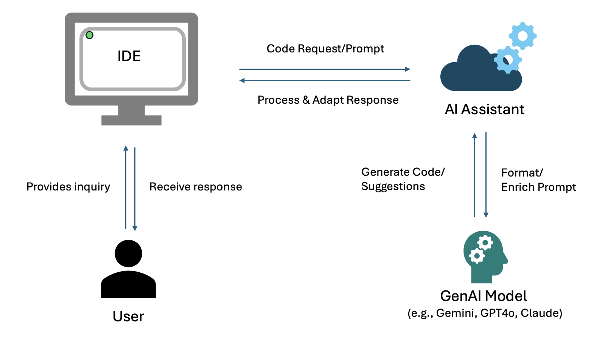

# Cloud Lab Codebot Comparison
## Document Overview and Purpose
This document provides a comprehensive comparison of five distinct codebots: Amazon Q Developer, Gemini Code Assist, GitHub Copilot, Anaconda AI Assistant, and Jupyter AI. The comparison is structured into three main sections: an overview of the key features of each codebot, a detailed feature comparison table, and a coding comparison table. By examining these aspects, the document aims to offer a thorough understanding of the capabilities and functionalities of each codebot.
The word ‘codebot’ in the document refers to tools that comprise of a user interface (UI), AI assistant, and a generative AI model (GenAI). What are AI assistants, you may ask? AI assistants are applications or systems that leverage AI technologies, including GenAI models, to assist users in performing tasks. These assistants are designed to understand user commands, provide information, and perform actions based on user input. The order of operation for these codebots is as follows: the user interacts with the user interface by submitting inquiries and viewing results. Once a user has submitted an inquiry, the AI assistant acts as an intermediary, focusing on enhancing the user experience by providing suggestions, information, and forwarding inquiries to the GenAI model. Sometimes, they even rewrite the user's inquiry to ensure the model can better understand it. The GenAI model works in the backend, focusing on generating new content and understanding patterns in data.

  

>[!IMPORTANT]
> **Disclaimer:** This document does not aim to discourage users from using any of the codebots mentioned. Our primary goal for this document is to showcase the merits and features offered by each codebot. The coding tests conducted use a limited number of prompts, and our observations are derived from this small subset of tests. Results may vary depending on the data and prompts given to the bots.

## Table of Contents
1. [Codebot Overview](#codebot-overview)
2. [General Features Comparison Table](#general-features-comparison-table) 
3. [Code Development Comparison Table](#code-development-comparison-table)
4. [Conclusion](#conclusion)
5. [Appendix](#appendix)

## Codebot Overview
This section offers a detailed introduction each codebot, highlighting their essential components, functionalities, and the significant advantages they provide. 
### Amazon Q Developer
**1. Overview** 
Amazon Q Developer is a generative artificial intelligence (AI) powered conversational assistant designed to enhance the software development process, particularly within the AWS ecosystem. It assists with various coding tasks such as providing inline code completions, generating new code, and scanning for security vulnerabilities. Amazon Q Developer can be accessed through IDEs like Visual Studio Code, JupyterLab, and the command line. It offers a companion chat extension that provides conversational AI assistance.
The models that Amazon Q utilizes are pre-trained with high-quality AWS content, allowing users to ask questions about AWS architecture, AWS resources, best practices, documentation, and support.

**2. Key Features**
- **Multi-model:** The codebot is trained on all the models available through AWS Bedrock. It uses multiple foundational models to complete its tasks and uses logic to route tasks to the model that is the best fit for the use case.
- **Quick Actions:**
  - **/fix:** Corrects errors in code.
  - **/optimize:** Suggests optimization methods.
  - **/explain:** Explains code snippets and provides enhancement suggestions.
  - **/test:** builds unit tests to evaluate and test code
- **Workspace context:** Ability to modify and interact with code within your IDE, creating inline edits.
### Gemini Code Assist
**1.	Overview**
Gemini Code Assist is an AI-powered application development tool designed to enhance software development and delivery velocity through generative AI assistance, while ensuring enterprise security and privacy protection. It offers features such as code completion, code generation, and natural language chat, making it a comprehensive solution for developers. Gemini Code Assist is integrated with multiple IDEs like Visual Studio Code and JetBrains IDEs and supports over 20 programming languages.
**2.	Key Features**
- **AI Code Assistance:** Completes your code as you write and generates whole code blocks or functions on demand. Available in many popular IDEs and supports 20+ programming languages.
- **Natural Language Chat:** Allows you to chat with Gemini Code Assist to get answers to coding questions or receive guidance on coding best practices. Available in all supported IDEs.
- **Code Transformation:** Comes with contextual smart actions and smart commands, quick shortcuts to automate tasks such as fixing code errors, generating code, and explaining code.
- **Enterprise Features:**
  - **Code Customization:** Customize Gemini Code Assist using your organization’s private codebases for more tailored assistance
  - **Local Codebase Awareness:** Generates code relevant to your application by grounding responses with context from your local codebase and current development session.
  - **Enterprise Security and Data Privacy:** Ensures enterprise-grade security and privacy for all code generation and assistance activities.
### **Jupyter AI**
**1.	Overview**
Jupyter AI is a generative AI tool integrated into Jupyter, designed to enhance productivity and creativity within JupyterLab and Jupyter Notebook environments. It transforms a Jupyter notebook into a dynamic AI playground. The AI conversational assistant can be installed through a Jupyter extension or through the `%%ai` command in a Jupyter notebook cell. 
**2.	Key Features**
- **%%ai:** The “magic ai” command transforms your Jupyter environment into an AI playground. This allows users to ask questions to the various models from a notebook cell.
- **Conversational Assistant:** A native UI in JupyterLab allows users to engage with AI models through a chat interface.
- **Generative Model Access:** Provides extensive access to models from several major providers, enabling diverse applications and experimentation. Including: AI21, Anthropic, AWS (Bedrock models), Cohere, Gemini, Hugging Face, MistralAI, NVIDIA, and OpenAI. Users can seamlessly interact with different models during use and use multiple models within the same notebook environment.
  - Access to certain models must be configured through an API key. 

> [!NOTE]
> Jupyter AI does not contain its own knowledge repository. It connects to various 3rd party models. In this comparison, we will be using Anthropic’s Claude Sonnet GenAI model hosted in AWS Bedrock (bedrock-chat:anthropic.claude-3-5-sonnet-20240620-v1:0). The performance of the different models can be expected to vary. 

### **GitHub Copilot**
**1.	Overview**
GitHub Copilot is an AI-powered code completion tool developed by GitHub in collaboration with OpenAI. It leverages machine learning models to assist developers by suggesting code snippets, completing lines of code, and even generating entire functions based on the context of the code being written. Integrated seamlessly into popular code editors like Visual Studio Code, GitHub Copilot enhances productivity by reducing the amount of boilerplate code developers need to write and helping them quickly implement complex algorithms. By learning from a vast dataset of public code repositories it provides intelligent and context-aware suggestions, making it an invaluable tool for both novice and experienced programmers. GitHub Copilot consists of two parts: AI that provides inline coding suggestions as you type and a companion chat extension that provides conversational AI assistance.

**2.	Key Features**
- **Code Completion:** Suggests code snippets and completes lines of code based on context.
- **Function Generation:** Generates entire functions or methods from comments or partial code.
- **Context-Aware Suggestions:** Provides intelligent and relevant code suggestions by understanding the surrounding code.
- **Multi-Language Support:** Supports a wide range of programming languages and frameworks.
- **Seamless Integration:** Integrates with popular code editors like Visual Studio Code.

### **Anaconda AI Assistant**
**1.	Overview**
Anaconda Assistant is an AI-powered helper specialized in Python programming and Jupyter Notebook environments. It excels at providing step-by-step guidance for code generation, debugging, and package recommendations, with a particular focus on data science and analytics tools. The assistant delivers responses with single code blocks for clarity and maintains context awareness through chat history. Key strengths include expertise in essential data science libraries (such as pandas, numpy, matplotlib, and scikit-learn), package management guidance, and best practices implementation for reproducible code. Whether you're working on data manipulation, analysis, or visualization tasks, Anaconda Assistant offers concise yet detailed support while emphasizing clear documentation and performance optimization. The assistant can be accessed through Anaconda Navigator via Anaconda Toolbox, which will launch a local JupyterLab environment.

**2.	Key Features**
- **Code Generation & Debugging:** Creates Python code on demand, provides error solutions, and offers syntax corrections using best practices.
- **Package Management & Integration:** Recommends appropriate libraries, helps with version compatibility, and provides installation guidance for the Anaconda ecosystem.
- **Interactive Learning Support:** Delivers step-by-step explanations, contextual examples, and best practices for code implementation in Jupyter Notebooks. Assists with DataFrame operations, statistical analysis, and data visualization using libraries like pandas, numpy, matplotlib, and seaborn.
- **Optimization & Performance:** Suggests code improvements, memory optimization techniques, and efficient data processing methods, particularly for large datasets and complex computations.

## General Features Comparison Table
The table below provides information on each codebot based on topics of general info, functionality, integration, and benchmarking. Additional notes are given in the [Appendix](#general-features-comparison-table-additional-notes).
>[!NOTE]
> - **Multipurpose Use** was evaluated based on whether the bot could conduct general LLM tasks (e.g., summarization) and code development.
> - **Speed scores** consisted of the maximum speed at which bots provided outputs.
> - **Consistency** was proven true if the output given by the bot remained the same when the same question was asked twice.

<table>
    <thead>
        <tr>
            <th>Topic</th>
            <th>Feature</th>
            <th>Amazon Q Developer</th>
            <th>Gemini Code Assist</th>
            <th>GitHub Copilot</th>
            <th>Anaconda AI Assistant</th>
            <th>Jupyter AI</th>
        </tr>
    </thead>
    <tbody>
        <tr>
            <th rowspan=4>General Info</th>
        </tr>
            <th rowspan=1>Developer</th>
            <td>AWS</td>
            <td>Google Cloud</td>
            <td>Microsoft/OpenAI</td>
            <td>Anaconda</td>
            <td>Project Jupyter</td>
        </tr>
        <tr>
            <th rowspan=1>Version Tested</th>
            <td>1.44.0</td>
            <td>2.25.1</td>
            <td>Copilot: 1.267.0; Copilot Chat: 0.24.0</td>
            <td>4.1.0</td>
            <td>2.29.0</td>
        </tr>
        <tr>
            <th rowspan=1>FedRAMP Approved</th>
            <td>Yes</td>
            <td>No</td>
            <td>No</td>
            <td>No</td>
            <td>No</td>
        </tr>
        <tr>
            <th rowspan=8>Functionality</th>
        </tr>
            <th rowspan=1>Programming Languages</th>
            <td>Python, Java, JavaScript, TypeScript, C#, Go, Rust, PHP, Ruby, Kotlin, C, C++, shell scripting, SQL, and Scala programming language </td>
            <td> Bash, C, C++, C#, Dart, Go, GoogleSQL, Java, JavaScript, Kotlin, Lua, MatLab, PHP, Python, R, Ruby, Rust, Scala, SQL, Swift, TypeScript, YAML </td>
            <td>Python, JavaScript, TypeScript, Java, C#, C++, Ruby, Go, Swift, Kotlin, PHP, Swift, Kotlin, PHP, HTML/CSS, SQL, Bash/Shell scripting</td>
            <td> Python, Bash/Shell scripting</td>
            <td>The Programming languages are dependent on the model selected</td>
        </tr>
        <tr>
            <th rowspan=1>Multipurpose Use</th>
            <td>No</td>
            <td>Yes</td>
            <td>Yes</td>
            <td>Yes</td>
            <td>Yes</td>
        </tr>
        <tr>
            <th rowspan=1>Offline Use</th>
            <td>AWS Private Link<a href="#fn2" id="ref2">2</a></td>
            <td>No</td>
            <td>No</td>
            <td>No</td>
            <td>No</td>
        </tr>
        <tr>
            <th rowspan=1>Local File Access</th>
            <td>Yes</td>
            <td>No</td>
            <td>Yes</td>
            <td>Yes</td>
            <td>Limited Access<a href="#fn7" id="ref7">7</a></td>
        </tr>
        <tr>
            <th rowspan=1>Data Security</th>
            <td>Data encryption at rest and in transit. 90-day data retention policy. Opt-out options are available to enhance security (e.g., data sharing/storage)</td>
            <td>Data encryption at rest and in transit. Opt-out options are available to enhance security (e.g., data sharing/storage).  </td>
            <td>Data encryption at rest and in transit; Restricts access. Filtering code to remove sensitive data (API, passwords). Does not save or share your data</td>
            <td>Data encryption at rest and in transit; Opt-out options are available to enhance security (e.g,. data sharing/storage)<a href="#fn6" id="ref6">6</a></td>
            <td>No security features mentioned </td>
        </tr>
        <tr>
            <th rowspan=1>Cross-Platfrom Knowledge</th>
            <td>No</td>
            <td>Yes</td>
            <td>Yes</td>
            <td>Yes<a href="#fn5" id="ref5">5</a></td>
            <td>Yes</td>
        </tr>
        <tr>
            <th rowspan=1>Pricing</th>
            <td>Free tier available (limited interactions);Paid enterprise tier at $19 per month. </td>
            <td>Standard: Monthly: $22.80 per user per month; Annual: $19 per user per month with an upfront annual commitment; Enterprise: Monthly: $54 per user per month. Annual: $45 per user per month with an upfront annual commitment </td>
            <td>Free (limited to 50 chat requests and 2,000 completions); Pro: $10/month; Business: $19/per user per month; Enterprise: $39/per user per month</td>
            <td> Free (limited to 5GM of memory); Starter: $15 per user/per month; Starter: $15 per user/per month; Business: $15 per user/per month; Enterprise: Custom</td>
            <td>Open source and free to use; Charges associated with using the 3rd party models may be incurred.</td>
        </tr>
        <tr>
            <th rowspan=5>Integration</th>
        </tr>
            <th rowspan=1>Prerequisites</th>
            <td>Free tier: Requires a Builder profile; Pro tier: Requires an AWS account and IAM Identity Center</td>
            <td>Requires a GCP account</td>
            <td>Microsoft/OpenAI</td>
            <td>Anaconda</td>
            <td>Project Jupyter</td>
        </tr>
        <tr>
            <th rowspan=1>Installation Method</th>
            <td>Installed as a plugin on extension in various IDEs</td>
            <td>Installed as an extension in various IDEs</td>
            <td>Installed as an extension in various IDEs</td>
            <td>Installed within Navigator as Anaconda Toolbox</td>
            <td>Installed via Jupyter extension or `pip` installation</td>
        </tr>
        <tr>
            <th rowspan=1>IDE Support</th>
            <td>JetBrains, Visual Studio Code, AWS Cloud, AWS Lambda console, JupyterLab via Sagemaker AI<a href="#fn1" id="ref1">1</a></td>
            <td>Visual Studio Code, JetBrains IDEs (IntelliJ, PyCharm, GoLand, WebStorm), Cloud Workstations, and Cloud Shell Editor</td>
            <td>Visual Studio Code, Visual Studio, PyCharm, IntelliJ IDEA, Eclipse, Atom, Sublime Text</td>
            <td>JupyterLab via Anaconda Navigator</td>
            <td>JupyterLab, Jupyter Notebook, Google Colab, VS Code </td>
        </tr>
        <tr>
            <th rowspan=1>API Support</th>
            <td>Available</td>
            <td>Available<a href="#fn3" id="ref3">3</a></td>
            <td>Available</td>
            <td>None mentioned</td>
            <td>None mentioned</td>
        </tr>
        <tr>
            <th rowspan=3>Benchmarking</th>
        </tr>
            <th rowspan=1>Speed</th>
            <td>100 sec</td>
            <td>35 sec</td>
            <td>20 sec</td>
            <td>34 sec</td>
            <td>30 sec</td>
        </tr>
        <tr>
            <th rowspan=1>Consistency</th>
            <td>Yes</td>
            <td>Yes</td>
            <td>Yes<a href="#fn4" id="ref4">4</a></td>
            <td>No</td>
            <td>Dependent on the model</td>
        </tr>
    </tbody>
</table>

## Code Development Comparison Table
Each test is designed to assess the skills of each model using prompts based on popular programming languages and workflow managers. The models were evaluated according to the following criteria: prompt requirements, language proficiency, context, and error handling. Additional observations/notes can be found in the [Appendix](#code-development-comparison-table-additional-notes).

The table below presents the evaluation criteria along with the corresponding scores: 
0 = No, 1 = Somewhat, 2 = Yes  

<table>
    <thead>
        <tr>
            <th>Test</th>
            <th>Criteria</th>
            <th>Amazon Q Developer<a href="#fn1t2" id="ref1t2">1,</a><a href="#fn2t2" id="ref2t2">2</a></th>
            <th>Gemini Code Assist<a href="#fn6t2" id="ref6t2">6</a></th>
            <th>GitHub Copilot</th>
            <th>Anaconda AI Assistant<a href="#fn17t2" id="ref17t2">17</a></th>
            <th>Jupyter AI</th>
        </tr>
    </thead>
    <tbody>
        <tr>
            <th rowspan=5>Scripting: Python</th>
        </tr>
            <th rowspan=1>Fulfills prompt requirements</th>
            <td>2</td>
            <td>2</td>
            <td>2</td>
            <td>2</td>
            <td>2</td>
        </tr>
        <tr>
            <th rowspan=1>Demonstrates proficiency in language</th>
            <td>2</td>
            <td>2</td>
            <td>2</td>
            <td>2</td>
            <td>2</td>
        </tr>
        <tr>
            <th rowspan=1>Includes comments and notes</th>
            <td>1</td>
            <td>1<a href="#fn3t2" id="ref3t2">3</a></td>
            <td>1</td>
            <td>2</td>
            <td>2</td>
        </tr>
        <tr>
          <th rowspan=1>Error Handling</th>
            <td>1</td>
            <td>2</td>
            <td>2</td>
            <td>2</td>
            <td>2</td>
        </tr>
            <th rowspan=5>Scripting: R</th>
        </tr>
            <th rowspan=1>Fulfills prompt requirements</th>
            <td>2</td>
            <td>2</td>
            <td>2</td>
            <td>-<a href="#fn11t2" id="ref11t2">11</a></td>
            <td>2</td>
        </tr>
        <tr>
            <th rowspan=1>Demonstrates proficiency in language</th>
            <td>2</td>
            <td>2</td>
            <td>2</td>
            <td>-</td>
            <td>2</td>
        </tr>
        <tr>
            <th rowspan=1>Includes comments and notes</th>
            <td>2</td>
            <td>2</td>
            <td>2</td>
            <td>-</td>
            <td>2</td>
        </tr>
        <tr>
          <th rowspan=1>Error Handling</th>
            <td>2</td>
            <td>2</td>
            <td>2</td>
            <td>-</td>
            <td>2</td>
        </tr>
        <tr>
            <th rowspan=5>Scripting: Snakemake</th>
        </tr>
            <th rowspan=1>Fulfills prompt requirements</th>
            <td>2</td>
            <td>2</td>
            <td>2</td>
            <td>2</td>
            <td>2</td>
        </tr>
        <tr>
            <th rowspan=1>Demonstrates proficiency in language</th>
            <td>2</td>
            <td>2</td>
            <td>2</td>
            <td>2</td>
            <td>2</td>
        </tr>
        <tr>
            <th rowspan=1>Includes comments and notes</th>
            <td>2</td>
            <td>2</td>
            <td>1<a href="#fn7t2" id="ref7t2">7</a></td>
            <td>1<a href="#fn12t2" id="ref12t2">12</a></td>
            <td>2</td>
        </tr>
        <tr>
          <th rowspan=1>Error Handling</th>
            <td>2</td>
            <td>2</td>
            <td>2</td>
            <td>2</td>
            <td>2</td>
        </tr>
        <tr>
            <th rowspan=5>Code Conversion: Python to Nextflow</th>
        </tr>
            <th rowspan=1>Fulfills prompt requirements</th>
            <td>2</td>
            <td>2</td>
            <td>2</td>
            <td>2</td>
            <td>1<a href="#fn9t2" id="ref9t2">9</a></td>
        </tr>
        <tr>
            <th rowspan=1>Demonstrates proficiency in language</th>
            <td>2</td>
            <td>2</td>
            <td>1<a href="#fn8t2" id="ref8t2">8</a></td>
            <td>1<a href="#fn13t2" id="ref13t2">13</a></td>
            <td>1</td>
        </tr>
        <tr>
            <th rowspan=1>Includes comments and notes</th>
            <td>1</td>
            <td>1<a href="#fn3t2" id="ref3t2">3,</a><a href="#fn4t2" id="ref4t2">4</a></td>
            <td>1<a href="#fn7t2" id="ref7t2">7</a></td>
            <td>1<a href="#fn12t2" id="ref12t2">12,</a><a href="#fn13t2" id="ref13t2">13</a></td>
            <td>2</td>
        </tr>
        <tr>
          <th rowspan=1>Error Handling</th>
            <td>1</td>
            <td>1<a href="#fn5t2" id="ref5t2">5</a></td>
            <td>2</td>
            <td>1<a href="#fn14t2" id="ref14t2">14</a></td>
            <td>1</td>
        </tr>
        <tr>
            <th rowspan=5>Error Debugging: WDL</th>
        </tr>
            <th rowspan=1>Fulfills prompt requirements</th>
            <td>2<a href="#fn10t2" id="ref10t2">10</a></td>
            <td>2</td>
            <td>2</td>
            <td>2</td>
            <td>0</td>
        </tr>
        <tr>
            <th rowspan=1>Demonstrates proficiency in language</th>
            <td>2</td>
            <td>2</td>
            <td>2</td>
            <td>2</td>
            <td>0</td>
        </tr>
        <tr>
            <th rowspan=1>Includes comments and notes</th>
            <td>1</td>
            <td>2</td>
            <td>2</td>
            <td>1</td>
            <td>0</td>
        </tr>
        <tr>
          <th rowspan=1>Error Handling</th>
            <td>2</td>
            <td>2</td>
            <td>2</td>
            <td>1</td>
            <td>0<a href="#fn15t2" id="ref15t2">15</a></td>
        </tr>
        <tr>
            <th rowspan=5>Optimization: BASH</th>
        </tr>
            <th rowspan=1>Fulfills prompt requirements</th>
            <td>2</td>
            <td>2</td>
            <td>2</td>
            <td>1<a href="#fn16t2" id="ref16t2">16</a></td>
            <td>2</td>
        </tr>
        <tr>
            <th rowspan=1>Demonstrates proficiency in language</th>
            <td>2</td>
            <td>2</td>
            <td>2</td>
            <td>2</td>
            <td>2</td>
        </tr>
        <tr>
            <th rowspan=1>Includes comments and notes</th>
            <td>1</td>
            <td>2</td>
            <td>2</td>
            <td>1</td>
            <td>2</td>
        </tr>
        <tr>
          <th rowspan=1>Error Handling</th>
            <td>1</td>
            <td>2</td>
            <td>2</td>
            <td>2</td>
            <td>2</td>
        </tr>
    </tbody>
</table>

## Conclusion
The development of codebots has significantly advanced the coding and software development process. Each codebot offers valuable features that can reduce the time required for code development, assist users in producing error-free code, and serve as a learning tool through the explanations provided. The comparison performed in this document demonstrated the key strengths each codebot offers. 
### Amazon Q Developer
The codebot consistently meets all prompt requirements across various scripting tasks, demonstrating a thorough understanding of task specifications. It shows proficiency in multiple languages such as Python, R, Snakemake, and Nextflow. While the codebot includes comments and explanations to aid users, there is room for improvement, as some scripts lacked guidance on implementation and readability. The codebot's ability to produce error-free code varies; while some errors could be resolved through additional prompting, this was not always the case. A standout feature is its ability to automatically modify and review files within the working directory, enhancing workflow efficiency. The inclusion of AWS-specific data in the model pre-training is a unique asset that Amazon Q Developer offers. Users with a specific need to understand the AWS cloud infrastructure in combination with coding capabilities would benefit from using Amazon Q Developer.
### Gemini Code Assist 
Gemini Code Assist demonstrated a thorough knowledge of the various scripting languages tested. The instructions and comments provided by Gemini allowed for a clear understanding of the output and served as a valuable learning aid for users. The codebot's ability to answer questions on various topics, including other cloud providers, was appreciated. It performed well in languages included in the training data, such as Python, R, and BASH (with Snakemake being based on Python). However, its performance was slightly less effective when working with Nextflow, which uses Groovey a language not explicitly covered in its training data. Overall, Gemini is a powerful coding assistant that can significantly enhance the coding experience of users through thoughtful insights and efficient code development.
### Jupyter AI 
Jupyter AI performed well in scripting languages such as Python, BASH, R, and Snakemake. A standout feature is its ability to produce codebot interaction results directly in a Python notebook output, aiding in documentation and creating informative records of the results. This feature enhances the user experience by making it easier to track and understand outcomes. Additionally, Jupyter AI's ability to connect to various models allows users to choose the model best suited to their needs. However, there were some limitations, such as results being cut short and the extension installation process being slightly difficult. Performance in Nextflow and WDL was not as successful. Despite these challenges, Jupyter AI offers unique features and use cases that can significantly benefit users.
### GitHub Copilot
GitHub Copilot performed well when working directly with programming scripts such as Python, R, and Bash. It provided clear instructions on how to install the necessary prerequisites with minor exclusions, like installing the programming language itself. When working with workflow managers, GitHub Copilot encountered some challenges with providing folder and file names and outlining folder structures. One of GitHub Copilot's unique abilities was showcased when working with Nextflow. It offered to create an entire workspace with a push of a button, showing its seamless integration with the IDE. It created a complete Nextflow workflow in the local environment, including a complete folder structure containing the Nextflow script, config files, schema, and an included README file with instructions to run the workflow. Although the script ran into errors, GitHub Copilot was able to correct these issues with minimal instruction. GitHub Copilot offers features and capabilities for users of all skill levels with a wide range of knowledge, excellent error handling, and special features that can enhance user experience.
### Anaconda AI Assistant
Anaconda AI Assistant demonstrates its significant capabilities as an AI-powered helper for Python programming and Jupyter Notebook environments, providing step-by-step guidance for code generation, debugging, and package recommendations, particularly in the context of data science and analytics tools. Its strengths lie in its proficiency with essential data science libraries such as pandas, numpy, matplotlib, and scikit-learn, and its ability to offer clear and concise support for data manipulation, analysis, and visualization tasks. However, it encounters difficulties with workflow managers, particularly in providing the correct syntax and guidance for folder structures, although some errors were resolved with further prompting. This codebot is best suited for users with some coding knowledge or those familiar with the specific use cases they wish to pursue. Overall, the Anaconda AI Assistant proves to be a valuable tool for Python programmers and data scientists, offering detailed support and optimization techniques for a wide range of tasks.

## Appendix
### General Features Comparison Table Additional Notes:
1. Anaconda AI Assistant faced some difficulty referencing code within the Jupyter notebook.<a href="#ref1" title="Jump back to footnote 1 in the table.">↩</a>

2. Offline use of Amazon Q is only supported in one US region currently<a href="#ref2" title="Jump back to footnote 2 in the table.">↩</a>

3.GitHub Copilot remained consistent with the scripts it provided, the explanations sometimes varied slightly, often including additional suggestions. Additionally, GitHub Copilot has general chat capabilities, but it struggled to reference chat history when asked to summarize a sentence, occasionally referencing the open file in the IDE instead.<a href="#ref3" title="Jump back to footnote 3 in the table.">↩</a>

4. Anaconda AI Assistant provides information across platforms but specifically API information of what python tools to install and providing script to connect to different platform services.<a href="#ref4" title="Jump back to footnote 4 in the table.">↩</a>

5. Anaconda AI Assistant allows you to opt out of sharing data with Anaconda but it will still send inquires to OpenAI.<a href="#ref5" title="Jump back to footnote 5 in the table.">↩</a>

6. Anaconda AI Assistant allows you to opt out of sharing data with Anaconda but it will still send inquires to OpenAI.<a href="#ref6" title="Jump back to footnote 6 in the table.">↩</a>

7. Jupyter AI allows for interaction with code found in notebook cells<a href="#ref7" title="Jump back to footnote 7 in the table.">↩</a>

### Code Development Comparison Table Additional Notes:
1. Over all Amazon Q Developer required specific instructions to provide an explanation of script outputted.<a href="#ref1t2" title="Jump back to footnote 1 in the table.">↩</a>

2. Over all Amazon Q Developer’s ability to produce error-free code varied. Minor errors were present in Python, Nextflow, and BASH scripts. Further prompting and troubleshooting sometimes allowed error-free code to be produced.<a href="#ref2t2" title="Jump back to footnote 2 in the table.">↩</a>

3. Over all Gemini Code Assist did not provide instructions on installation steps and workflow execution in certain tests like Python scripting and code conversion.<a href="#ref3t2" title="Jump back to footnote 3 in the table.">↩</a>

4. When producing multiple files in the Python to Nextflow conversion test, Gemini did not specify each file name, leading to a lack of clarity in the output. Further prompting and clarification aided in improving the clarity of responses. <a href="#ref4t2" title="Jump back to footnote 4 in the table.">↩</a>

5. The Gemini Code Assist output contained syntax errors in tests such as the Python to Nextflow conversion, resulting in an error message when parsing input files. Further troubleshooting did not resolve the issue.<a href="#ref5t2" title="Jump back to footnote 5 in the table.">↩</a>

6. Over all GitHub Copilot sometimes requires further instruction to provide installation details on the programming language itself (Python, Nextflow) when suppling context to the output.<a href="#ref6t2" title="Jump back to footnote 6 in the table.">↩</a>

7. GitHub Copilot had trouble providing consistent folders structure instructions and file names for Nextflow and Snakemake workflows. Sometimes providing different information between the script and explanation.<a href="#ref7t2" title="Jump back to footnote 7 in the table.">↩</a>

8. When creating the Nextflow config file GitHub Copilot encountered difficulty providing the correct format and syntax for specifying docker containers per workflow process. Further prompting mitigated the error.<a href="#ref8t2" title="Jump back to footnote 8 in the table.">↩</a>

9. In the Python to Nextflow conversion test, Jupyter AI produced a truncated output that ended abruptly in the middle of a file was produced. Due to this incomplete response, the output did not run to completion.<a href="#ref9t2" title="Jump back to footnote 9 in the table.">↩</a>

10. In the error debugging test, Jupyter AI did not recognize the WDL syntax. When prompted, a “ValueError” occurred. The codebot was able to answer theoretical questions related to WDL.<a href="#ref10t2" title="Jump back to footnote 10 in the table.">↩</a>

11. Anaconda AI Assistant was not tested on R scripting because the documentation states it is only knowledgeable in Python and Bash scripting.<a href="#ref11t2" title="Jump back to footnote 11 in the table.">↩</a>

12. Activating and switching conda environments proved difficult with instructions given, required further prompting.<a href="#ref12t2" title="Jump back to footnote 12 in the table.">↩</a>

13. Folder structures for workflow managers proved difficult for Anaconda AI Assistant to provide instruction on for Nextflow conversion test. Script didn’t seem to provide up to date practices and syntax.<a href="#ref13t2" title="Jump back to footnote 13 in the table.">↩</a>

14. Nextflow conversion test proved difficult for Anaconda AI Assistant resulting in syntax error specifically with channels. Further troubleshooting did not resolve the issue.<a href="#ref14t2" title="Jump back to footnote 14 in the table.">↩</a>

15. Anaconda AI Assistant required further prompting to resolve errors for the WDL Error Debugging test.<a href="#ref15t2" title="Jump back to footnote 15 in the table.">↩</a>

16. The Anaconda AI Assistant converted bash scripts and commands to Python when it should have remained in bash.<a href="#ref16t2" title="Jump back to footnote 16 in the table.">↩</a>

17. Over all some outputted code or scripts (Bash, WDL, Nextflow) Anaconda AI Assistant provided contained headers that caused errors. Commenting out headers resolved the issue.<a href="#ref17t2" title="Jump back to footnote 17 in the table.">↩</a>
